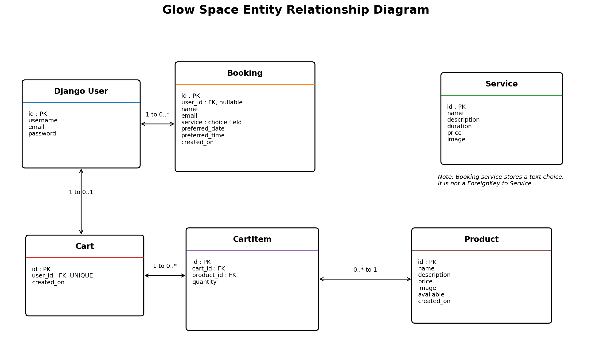

# Glow Space

Glow Space is a full-stack Django web application that combines an online salon booking system with a beauty product e-commerce store. Customers can browse salon services, purchase products, book appointments, and manage their bookings through a secure account.

The application was developed as Milestone Project 4 for the Code Institute Diploma in Full Stack Software Development.

## Live Project

### Live Website

*(Render deployment link will be added after deployment.)*

### GitHub Repository

*(GitHub repository link will be added here.)*

## Table of Contents

- [Project Overview](#project-overview)
- [User Experience (UX)](#user-experience-ux)
  - [Project Goals](#project-goals)
  - [Target Audience](#target-audience)
  - [User Goals](#user-goals)
  - [Site Owner Goals](#site-owner-goals)
- [Agile Development](#agile-development)
 - [Development Approach](#development-approach)
  - [Version Control](#version-control)
  - [User Stories](#user-stories)
- [Database Design](#database-design)
- [Features](#features)
- [Technologies Used](#technologies-used)
- [Testing](#testing)
- [Bugs](#bugs)
- [Deployment](#deployment)
- [Credits](#credits)
- [Acknowledgements](#acknowledgements)

## Project Overview

Glow Space is designed to provide customers with a modern and convenient online beauty salon experience. The application combines appointment booking with an integrated e-commerce platform, allowing users to browse salon services, purchase beauty products, and manage appointments from a single website.

The project focuses on delivering a clean, responsive and user-friendly interface while demonstrating full-stack web development using Django, PostgreSQL, HTML, CSS, JavaScript and Bootstrap.

The application was built with scalability in mind, allowing additional salon services, beauty products and future features to be incorporated with minimal changes to the existing structure.

## User Experience (UX)

### Project Goals

The primary goal of Glow Space is to provide customers with an easy-to-use platform where they can:
- Browse salon services.
- Book appointments online.
- Purchase beauty products.
- Manage appointments securely.

The application also provides the salon owner with an administration area where services, products, bookings and customer information can be managed efficiently through Django Admin.

---

### Target Audience

Glow Space is designed for:

- Existing salon customers.
- New customers looking for beauty services.
- Customers interested in purchasing beauty products.
- Users who prefer online appointment booking.
- Mobile, tablet and desktop users.

---

### User Goals

Users should be able to:

- Register for an account.
- Log in securely.
- Browse salon services.
- View product information.
- Purchase beauty products securely.
- Book appointments.
- Manage appointments.
- View previous bookings.

---

### Site Owner Goals

The site owner should be able to:

- Manage products.
- Manage services.
- Manage appointments.
- Manage customer information.
- Process customer orders.
- Present a professional online presence.

## Agile Development

### Development Approach

Glow Space was developed using an iterative approach. Rather than trying to build the entire application at once, I focused on completing one feature at a time before moving on to the next.

Each feature was planned, implemented, tested and then committed to GitHub using clear commit messages. This approach made it easier to track progress, revisit earlier work when necessary, and fix issues without affecting other parts of the application.

Throughout the project, development evolved as new ideas and improvements emerged. Features such as the services carousel, product presentation and booking system were refined over time based on testing and usability considerations.

As the project progressed, I revisited and refined several features as my understanding of Django and user experience grew. This iterative approach helped me improve the overall consistency of the application while reinforcing the importance of testing, incremental development and version control.

---

### Version Control

Git and GitHub were used throughout the project to manage development. Regular commits were made as features were completed or improved, providing a clear record of the project's progress from the initial setup through to the final stages of development.

Regular commits also provided clear milestones throughout development, making it easier to review progress and maintain a stable codebase as new features were introduced.

---

### User Stories

| User Story | Status |
|------------|:------:|
| As a visitor, I can browse salon services so that I can decide what I need. | ✅ |
| As a customer, I can register an account. | ✅ |
| As a customer, I can log in securely. | ✅ |
| As a customer, I can book an appointment. | ✅ |
| As a customer, I can edit my appointment. | ✅ |
| As a customer, I can cancel my appointment. | ✅ |
| As a customer, I can browse products. | ✅ |
| As a customer, I can view product details. | ✅ |
| As a customer, I can add products to my cart. | ✅ |
| As a customer, I can complete a purchase. | ✅ |
| As an administrator, I can manage products. | ✅ |
| As an administrator, I can manage services. | ✅ |
| As an administrator, I can manage bookings. | ✅ |

## Database Design

Glow Space uses a relational PostgreSQL database managed through Django's ORM. The database has been designed to separate responsibilities across individual models while maintaining clear relationships between users, bookings, services, products and shopping carts.

The design allows authenticated users to book salon appointments, browse products, manage shopping carts and complete purchases, while administrators can manage services, products and appointments through the Django administration panel.

### Entity Relationship Diagram

---

### Database Models

The application is built around six main database models. Each model has a specific responsibility and works together to provide the booking and e-commerce functionality of the website.

| Model | Purpose |
|---|---|
| **User** | Uses Django's built-in authentication system to manage user registration, login and account information. |
| **Service** | Stores the salon services offered by Glow Space, including the service name, description, duration, price and optional image displayed on the website. |
| **Booking** | Stores appointment details submitted by authenticated users, including the selected service, preferred date and time, customer name, email address and creation date. |
| **Product** | Stores beauty products available for purchase, including the product name, description, price, optional image, availability status and creation date. |
| **Cart** | Represents one shopping cart linked to one registered user and groups the products selected before checkout. |
| **CartItem** | Connects a product to a shopping cart and stores the quantity selected. It also calculates the subtotal for that item. |

---

### Model Relationships

- One user can have multiple bookings.
- One user can have one shopping cart.
- One cart can contain multiple cart items.
- One product can appear in multiple cart items.
- Each cart item belongs to one cart and references one product.
- The selected service in the Booking model is stored as a predefined text choice rather than as a foreign key to the Service model.

## Features

Glow Space includes a range of features that support both salon appointment booking and online product purchasing.

### User Registration and Authentication

Users can create an account, log in and log out securely using Django's built-in authentication system.

Authentication is required for:

- Booking appointments.
- Viewing personal appointments.
- Editing appointments.
- Cancelling appointments.

Authentication is not required for:

- Browsing products.
- Accessing the shopping cart.
- Completing a purchase.

---

### Responsive Navigation

The navigation bar provides access to the main sections of the website, including:

- Home.
- Services.
- Products.
- Bookings.
- Contact.
- My Appointments.

The navigation menu adapts for smaller screen sizes to improve usability on mobile and tablet devices.

---

### Salon Services Carousel

Salon services are loaded dynamically from the database and displayed in a responsive Swiper carousel.

Each service card includes:

- Service name.
- Description.
- Duration, where provided.
- Price.
- Service image, where available.
- A booking button.

The carousel displays a different number of service cards depending on the screen size.

---

### Appointment Booking

Authenticated users can submit appointment requests by entering:

- Their name.
- Email address.
- Selected service.
- Preferred date.
- Preferred time.

The booking system validates the submitted details and prevents:

- Incomplete submissions.
- Dates in the past.
- Times outside opening hours.
- Sunday bookings.
- Duplicate bookings for the same date and time.

Successful bookings are saved to the database and displayed in the user's appointment area.

---

### Appointment Management

Users can view their own appointments after logging in.

They can also:

- Edit an existing appointment.
- Update the service, date or time.
- Cancel an appointment.
- Receive success or error messages after an action.

---

### Product Catalogue

Available beauty products are loaded from the database and displayed in a responsive product grid.

Each product card includes:

- Product image.
- Product name.
- Description.
- Price.
- A link to the product detail page.

---

### Product Detail Page

Each product has a dedicated detail page where users can view more information before making a purchase.

The page includes:

- A larger product image.
- Full product description.
- Price.
- Add to Cart button.
- Buy Now button.

---

### Shopping Cart

Authenticated users can add products to their personal shopping cart.

The cart allows users to:

- Increase item quantities.
- Reduce item quantities.
- Remove products.
- View item subtotals.
- View the total cart value.

Each registered user has one shopping cart linked to their account.

---

### Stripe Checkout

Glow Space uses Stripe Checkout to process test payments securely.

Users can proceed from the cart to the Stripe-hosted checkout page. After a successful payment, the cart is cleared and a confirmation message is displayed.

---

### Django Administration

The Django administration panel allows the site owner to manage:

- Users.
- Services.
- Products.
- Bookings.
- Shopping carts.
- Cart items.

This gives the administrator control over the main content and data used by the application.

---

### User Feedback Messages

Django messages are used throughout the application to provide clear feedback after actions such as:

- Successful registration.
- Successful appointment booking.
- Appointment updates.
- Appointment cancellation.
- Adding products to the cart.
- Successful payment.
- Validation errors.

---

### Responsive Design

The application is designed to work across:

- Mobile phones.
- Tablets.
- Laptops.
- Desktop screens.

Responsive layouts are used for the navigation bar, service carousel, product grid, booking page, product details and authentication pages.

## Technologies Used

### Languages

The following programming languages were used throughout the development of this project:

- HTML5
- CSS3
- JavaScript
- Python

### Frameworks and Libraries

The following frameworks and libraries were used:

- Django
- Bootstrap 5
- Swiper.js
- Gunicorn
- Stripe

### Database

- PostgreSQL (Production)
- SQLite (Development)

### Version Control

- Git
- GitHub

### Deployment

- Render
- Gunicorn
- WhiteNoise

### Development Tools

- Visual Studio Code
- GitHub Desktop
- Chrome Developer Tools
- Draw.io (ER Diagram)
- Favicon.io
- Google Fonts

### Django Packages

The following Python packages were used to support the development, deployment and functionality of the application:

- **asgiref** – Supports Django's asynchronous features.
- **dj-database-url** – Parses the database URL for PostgreSQL deployment.
- **Pillow** – Handles image uploads for products and services.
- **psycopg2-binary** – PostgreSQL database adapter used in production.
- **python-decouple** – Stores sensitive information such as secret keys and API credentials in environment variables.
- **requests** – Handles HTTP requests to external services where required.
- **WhiteNoise** – Serves static files efficiently in the deployed application.

---

### Payment Processing

- **Stripe Checkout** – Processes secure online payments for customer purchases.

## Credits

### Content

All written content was created specifically for this project.

### Images

Product and service images were created, edited or sourced from royalty-free platforms such as Unsplash, where applicable.

### Code

The project was developed using Django and follows the structure and best practices taught throughout the Code Institute Full Stack Software Development Diploma.

Official documentation from Django, Bootstrap, Stripe and Swiper.js was consulted during development to better understand implementation details and recommended practices.

Any external guidance was used for learning purposes only. All code was written, adapted and integrated specifically for this project.

## Acknowledgements

I would like to express my sincere appreciation to:

- The Code Institute team and mentors for delivering useful webinars and guidance throughout the MS4 project.
- The Code Institute tutors and support team for their assistance during development.
- The Code Institute learning materials for providing the foundation for this project.
- My family for their patience, encouragement and support throughout my studies.
- Everyone who tested the application and provided valuable feedback that helped improve the user experience.

