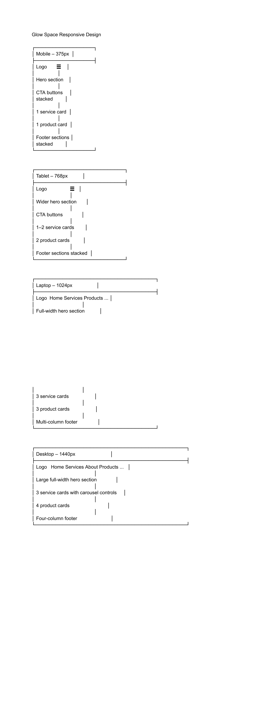

# Glow Space



Glow Space is a full-stack Django web application that combines an online salon appointment system with a beauty product e-commerce store. Customers can browse salon services and products, book appointments, manage their bookings and complete test purchases through Stripe Checkout.

The application was developed as Milestone Project 4 for the Code Institute Diploma in Full Stack Software Development.

## Live Project

### Live Website

The deployed application can be viewed here:

[Glow Space Live Website](https://glow-space.onrender.com/)

### GitHub Repository

The project source code is available here:

[Glow Space GitHub Repository](https://github.com/Vera-com/glow-space)

## Table of Contents

- [Project Overview](#project-overview)
- [User Experience](#user-experience-ux)
  - [Project Goals](#project-goals)
  - [Target Audience](#target-audience)
  - [User Goals](#user-goals)
  - [Site Owner Goals](#site-owner-goals)
  - [Responsive Design Planning](#responsive-design-planning)
- [Agile Development](#agile-development)
  - [Development Approach](#development-approach)
  - [Version Control](#version-control)
  - [User Stories](#user-stories)
- [Database Design](#database-design)
  - [Entity Relationship Diagram](#entity-relationship-diagram)
  - [Database Models](#database-models)
  - [Model Relationships](#model-relationships)
- [Features](#features)
- [Technologies Used](#technologies-used)
- [Security](#security)
- [Testing](#testing)
- [Bugs](#bugs)
  - [Known Limitations](#known-limitations)
- [Deployment](#deployment)
  - [Clone and Run the Project Locally](#clone-and-run-the-project-locally)
  - [AWS S3 Media Storage](#aws-s3-media-storage)
  - [Render Deployment](#render-deployment)
- [Future Improvements](#future-improvements)
- [Credits](#credits)
- [Acknowledgements](#acknowledgements)

## Project Overview

Glow Space was designed to provide customers with a modern and convenient online beauty salon experience.

The application combines appointment booking with an e-commerce platform, allowing customers to browse salon services, view beauty products, manage appointments and complete test payments from one website.

The project focuses on providing a clean, responsive and user-friendly interface while demonstrating full-stack web development using Django, Python, PostgreSQL, HTML, custom CSS and JavaScript.

The application can be expanded in the future with additional salon services, products, appointment-management features and order-processing functionality.

## User Experience (UX)

### Project Goals

The main goal of Glow Space is to provide customers with an easy-to-use platform where they can:

- Browse available salon services.
- View beauty products.
- Book appointments online.
- View, edit and cancel their appointments.
- Add products to a personal shopping cart.
- Complete secure test payments through Stripe Checkout.

The application also provides the salon owner with a Django administration area where users, services, products, appointments and shopping-cart data can be managed.

### Target Audience

Glow Space is designed for:

- Existing salon customers.
- New customers looking for beauty services.
- Customers interested in beauty and self-care products.
- Users who prefer booking appointments online.
- Mobile, tablet, laptop and desktop users.

### User Goals

Users should be able to:

- Register for an account.
- Log in and log out securely.
- Browse salon services.
- View available products.
- View individual product information.
- Book an appointment.
- View their own appointments.
- Edit or cancel their appointments.
- Add products to a shopping cart.
- Change product quantities or remove products.
- Complete a test purchase securely through Stripe Checkout.

### Site Owner Goals

The site owner should be able to:

- Manage registered users.
- Create and update salon services.
- Create and update beauty products.
- View and manage appointments.
- View shopping carts and cart items.
- Maintain a professional online presence for the salon.

### Responsive Design Planning

Glow Space was designed to work across different screen sizes.

The initial responsive planning considered the following layouts:

- **Mobile – 375px:** hamburger navigation, stacked content, one service card and one product card at a time.
- **Tablet – 768px:** wider content area, responsive navigation and up to two cards in suitable sections.
- **Laptop – 1024px:** full navigation, wider hero content and multi-column layouts.
- **Desktop – 1440px:** full-width presentation, multiple service and product cards and a multi-column footer.

The wireframe below shows the intended responsive layout:


The final application was tested at mobile, tablet, laptop and desktop widths using Chrome Developer Tools.

## Agile Development

### Development Approach

Glow Space was developed using an iterative approach. Rather than attempting to build the complete application at once, I focused on implementing one feature at a time.

Features were planned, developed, tested and then committed to GitHub. This made it easier to track progress, identify errors and return to earlier parts of the project when improvements were required.

The project developed gradually as my understanding of Django, database relationships, authentication and user experience improved.

Features such as the services carousel, product layout, appointment validation, shopping cart, Stripe Checkout and user ownership protection were refined during development after testing their behaviour.

This approach helped me maintain a stable application while gradually improving its functionality and presentation.

### Version Control

Git and GitHub were used throughout the project.

Regular commits were made when features were added, corrected or improved. The commit history provides a record of the development process from the initial project setup to deployment, testing and documentation.

Descriptive commit messages were used to explain the main purpose of each change.

### User Stories

| User Story | Status |
|---|:---:|
| As a visitor, I can browse salon services so that I can decide which service I need. | ✅ |
| As a visitor, I can browse products so that I can see what is available. | ✅ |
| As a visitor, I can view individual product information. | ✅ |
| As a customer, I can register for an account. | ✅ |
| As a customer, I can log in securely. | ✅ |
| As a customer, I can log out of my account. | ✅ |
| As a customer, I can book an appointment. | ✅ |
| As a customer, I can view my own appointments. | ✅ |
| As a customer, I can edit my appointment. | ✅ |
| As a customer, I can cancel my appointment. | ✅ |
| As a customer, I can add products to my personal shopping cart. | ✅ |
| As a customer, I can update product quantities in my cart. | ✅ |
| As a customer, I can remove products from my cart. | ✅ |
| As a customer, I can complete a test payment through Stripe Checkout. | ✅ |
| As an administrator, I can manage users. | ✅ |
| As an administrator, I can manage products. | ✅ |
| As an administrator, I can manage services. | ✅ |
| As an administrator, I can manage bookings. | ✅ |
| As an administrator, I can view carts and cart items. | ✅ |

## Database Design

Glow Space uses a relational PostgreSQL database in production. SQLite was used during local development.

Django's Object-Relational Mapper manages communication between the application and the database.

The application uses five custom models together with Django's built-in User model. These models support salon services, appointment booking, product management and user-specific shopping carts.

Authenticated users can create and manage appointments, add products to their carts and complete payments through Stripe Checkout. Administrators can manage the application's main records through Django Admin.

### Entity Relationship Diagram


### Database Models

| Model | Purpose |
|---|---|
| **User** | Django's built-in authentication model, used for registration, login, password security and account ownership. |
| **Service** | Stores salon services, including the service name, description, duration, price and optional image. |
| **Booking** | Stores appointment information, including the authenticated user, customer name, email address, selected service, preferred date, preferred time and creation date. |
| **Product** | Stores product information, including the name, description, price, image, availability status and creation date. |
| **Cart** | Represents one shopping cart connected to one authenticated user. |
| **CartItem** | Connects a product to a cart, stores the selected quantity and calculates the item subtotal. |

### Model Relationships

- One user can have multiple bookings.
- Each booking belongs to one authenticated user.
- One user can have one shopping cart.
- Each cart belongs to one user.
- One cart can contain multiple cart items.
- Each cart item belongs to one cart.
- Each cart item references one product.
- One product can appear in multiple cart items.
- The selected service in the Booking model is stored as a predefined text choice rather than as a foreign key to the Service model.

## Features

### User Registration and Authentication

Users can create an account, log in and log out using Django's built-in authentication system.

Authentication is required for:

- Booking appointments.
- Viewing personal appointments.
- Editing appointments.
- Cancelling appointments.
- Adding products to a shopping cart.
- Accessing the shopping cart.
- Using Buy Now.
- Completing a Stripe Checkout payment.

Authentication is not required for:

- Viewing the homepage.
- Browsing salon services.
- Browsing products.
- Viewing individual product details.

### Responsive Navigation

The main navigation provides access to the important sections of the application, including:

- Home.
- Services.
- Products.
- Bookings.
- Contact.
- My Appointments.
- Shopping Cart.
- Login, registration and logout options.

The navigation changes to a hamburger-style menu on smaller screens.

Authentication-related links are displayed according to the user's login status.

### Salon Services Carousel

Salon services are loaded from the database and displayed in a responsive Swiper carousel.

Each service card can display:

- Service name.
- Description.
- Duration.
- Price.
- Service image.
- Booking button.

The number of visible service cards changes according to the available screen width.

### Appointment Booking

Authenticated users can submit appointment requests using the booking form.

The form collects or displays:

- Customer name.
- Email address.
- Selected service.
- Preferred date.
- Preferred time.

The booking system includes server-side validation and prevents:

- Incomplete submissions.
- Dates in the past.
- Appointment times in the past.
- Times outside salon opening hours.
- Sunday bookings.
- Duplicate appointments for the same date and time.

Each booking is linked to the authenticated user who created it.

After a successful submission, the booking is saved to the database and displayed in the user's My Appointments area.

### Appointment Management

Logged-in users can view their own appointments.

Users can:

- View appointment information.
- Edit the selected service.
- Update the email address.
- Update the date or time.
- Cancel an appointment.
- Receive success or error messages after an action.

Appointment ownership is checked on the server side. Edit and delete views retrieve the booking using both its ID and the currently authenticated user.

This prevents one user from editing or deleting another user's appointment.

### Product Catalogue

Available products are loaded from the database and displayed in a responsive product grid.

Each product card includes:

- Product image.
- Product name.
- Short description.
- Price.
- Link to the product detail page.

### Product Detail Page

Each product has an individual detail page.

The page includes:

- A larger product image.
- Full product description.
- Price.
- Add to Cart button.
- Buy Now button.

### Shopping Cart

Each authenticated user has a personal shopping cart.

The cart allows the user to:

- Add products.
- Increase quantities.
- Reduce quantities.
- Remove products.
- View item subtotals.
- View the total cart value.
- Continue to Stripe Checkout.

### Stripe Checkout

Glow Space uses Stripe Checkout to process test payments securely.

A logged-in user can proceed to Stripe Checkout from the cart or use the Buy Now option for an individual product.

Stripe handles the payment-card information on its hosted checkout page rather than inside Glow Space.

After a successful test payment:

- The user is redirected to a confirmation page.
- A success message is displayed.
- Products in the shopping cart are removed.

If the checkout is cancelled, the payment is not completed and the user is returned to the shopping cart.

### Django Administration

The Django administration panel allows authorised administrators to manage:

- Registered users.
- Salon services.
- Products.
- Bookings.
- Shopping carts.
- Cart items.

Regular users cannot access Django Admin or directly modify stored database records through it.

### User Feedback Messages

Django messages provide feedback after important actions, including:

- Successful registration.
- Successful login and logout.
- Successful appointment booking.
- Appointment updates.
- Appointment cancellation.
- Products added to the cart.
- Cart updates.
- Successful payment.
- Validation errors.

### Custom Error Pages

Glow Space includes custom error pages to provide a clearer experience when an error occurs.

The custom pages include:

- A 404 page for pages or resources that do not exist.
- A 500 page for internal server errors.

The production error pages are displayed when `DEBUG` is set to `False`.

### Responsive Design

The application is designed for:

- Mobile phones.
- Tablets.
- Laptops.
- Desktop screens.

Responsive layouts are used throughout the navigation, hero section, service carousel, product grid, booking forms, appointment pages, product pages, cart and authentication pages.

## Technologies Used

### Languages

- HTML5
- CSS3
- JavaScript
- Python

### Frameworks and Libraries

- Django
- Swiper.js
- Font Awesome
- Stripe
- Gunicorn
- WhiteNoise

Bootstrap was not used. The user interface was created using custom CSS.

### Database and File Storage

- PostgreSQL – production relational database.
- SQLite – local development database.
- AWS S3 – storage for uploaded product and service images.

### Version Control

- Git
- GitHub

### Deployment

- Render
- Gunicorn
- WhiteNoise
- AWS S3

### Development and Testing Tools

- Visual Studio Code.
- Git.
- GitHub.
- Chrome Developer Tools.
- Draw.io.
- Favicon.io.
- W3C HTML Validator.
- W3C CSS Validator.
- Flake8.
- Lighthouse.

### Main Python Packages

- **Django** – provides the main web framework, ORM, templates, authentication system and administration area.
- **asgiref** – supports Django's asynchronous functionality.
- **dj-database-url** – reads the production PostgreSQL database URL.
- **Gunicorn** – runs the Django application in production.
- **Pillow** – supports image uploads for products and services.
- **psycopg2-binary** – connects Django to PostgreSQL.
- **python-decouple** – reads configuration values from environment variables.
- **Stripe** – integrates Stripe Checkout with the application.
- **WhiteNoise** – serves static files in production.

## Security

Security was considered throughout development and deployment.

The following measures are used:

- Django's authentication system handles user passwords securely.
- Passwords are stored using Django's password-hashing system rather than as plain text.
- Booking, appointment, cart and checkout pages are protected with `@login_required`.
- Appointment ownership is checked before a booking can be edited or deleted.
- Regular users cannot directly access Django Admin.
- Stripe handles payment-card information on its hosted checkout page.
- The Django secret key, database URL, Stripe keys and AWS credentials are stored in environment variables.
- The local `.env` file is included in `.gitignore`.
- Sensitive credentials are not committed to GitHub.
- Production `DEBUG` is set to `False`.
- Allowed hosts and trusted CSRF origins are configured for the deployed domain.
- CSRF protection is included on forms that submit data.
- Custom error pages prevent detailed production debugging information from being exposed to users.

## Testing

Testing was carried out throughout the development of Glow Space rather than being left until the end of the project.

Features were tested after implementation and were retested after later changes to ensure that existing functionality continued to work.

Testing covered:

- Manual feature testing.
- User story testing.
- CRUD functionality.
- Authentication and authorisation.
- Appointment ownership protection.
- Booking validation.
- Shopping-cart functionality.
- Stripe test payments.
- Responsive design.
- Browser compatibility.
- HTML validation.
- CSS validation.
- Python code style using Flake8.
- Django system checks.
- Migration checks.
- Lighthouse auditing.
- Custom error pages.
- Bug identification, correction and retesting.

A full record of the testing process, results, screenshots and resolved issues is available in the [TESTING.md](TESTING.md) file.

## Bugs

Several issues were identified and corrected during development.

These included:

- Services disappearing when the database queryset was not passed to the homepage template.
- A service image failing to display because it was referenced outside the service loop.
- A missing Django template closing tag causing a `TemplateSyntaxError`.
- Uneven service cards and unreliable carousel movement in the original slider.
- Conflicting CSS affecting the Swiper navigation controls.
- Product images appearing cropped because of the original image-fit setting.
- Product cards becoming uneven because of different description lengths.
- Buy Now initially including products that were already in the cart.
- Appointment dates and times initially accepting invalid selections.
- A missing Stripe success template.
- The default Django 404 page appearing locally while `DEBUG` was enabled.
- Users initially being able to enter a different name when booking.
- Appointment edit and delete views initially requiring stronger ownership protection.
- Python validation reporting an unused import inside the original test file.
- Autoprefixer adding older browser declarations that caused CSS validator errors.

These issues were corrected and retested. Further details are recorded in [TESTING.md](TESTING.md).

### Known Limitations

- Glow Space currently uses one main custom Django app for the closely related salon, booking, product and cart functionality.
- The selected booking service is stored as a predefined text choice rather than as a foreign key to the Service model.
- Successful payments are not currently stored in a dedicated Order model.
- Stripe Checkout cancellation returns the user to the cart but does not currently display a separate cancellation message.
- Some product and service images are relatively large and can affect loading performance.
- Lighthouse results may vary between runs because of Render response times, network conditions, browser activity and external resources.
- Automated Django unit tests were not completed. The application was tested using a structured manual testing procedure and code-validation tools.

## Deployment

Glow Space is deployed on Render. The production application uses PostgreSQL for database storage and AWS S3 for uploaded media files.

The production setup includes:

- **Render** – hosts the Django web application.
- **PostgreSQL** – stores users, bookings, services, products, carts and cart items.
- **AWS S3** – stores uploaded product and service images.
- **WhiteNoise** – serves static files such as CSS, JavaScript and fixed website images.
- **Gunicorn** – runs the Django application in production.

### Clone and Run the Project Locally

#### Requirements

The following are required to run the project locally:

- Python 3.
- Git.
- pip.
- A code editor.
- Stripe test credentials for payment functionality.
- AWS credentials if S3 media storage will be used.

#### Clone the Repository

1. Open the [Glow Space GitHub repository](https://github.com/Vera-com/glow-space).

2. Select the green **Code** button and copy the HTTPS URL.

3. Open a terminal and run:

```bash
git clone https://github.com/Vera-com/glow-space.git
```

4. Move into the project folder:

```bash
cd glow-space
```

#### Create and Activate a Virtual Environment

Create a virtual environment:

```bash
python -m venv venv
```

Activate it on macOS or Linux:

```bash
source venv/bin/activate
```

Activate it on Windows:

```bash
venv\Scripts\activate
```

#### Install Dependencies

Install the packages listed in `requirements.txt`:

```bash
pip install -r requirements.txt
```

#### Environment Variables

Create a `.env` file in the root directory of the project.

Add the required local values:

```text
SECRET_KEY=your-django-secret-key
DEBUG=True
STRIPE_PUBLIC_KEY=your-stripe-public-key
STRIPE_SECRET_KEY=your-stripe-secret-key
```

When using PostgreSQL and AWS S3, also add:

```text
DATABASE_URL=your-postgresql-database-url
AWS_ACCESS_KEY_ID=your-aws-access-key
AWS_SECRET_ACCESS_KEY=your-aws-secret-access-key
AWS_STORAGE_BUCKET_NAME=your-s3-bucket-name
AWS_S3_REGION_NAME=your-aws-region
```

The `.env` file must not be committed to GitHub.

#### Prepare the Database

Apply the database migrations:

```bash
python manage.py migrate
```

Create an administrator account:

```bash
python manage.py createsuperuser
```

#### Run the Development Server

Start the local server:

```bash
python manage.py runserver
```

Open the application at:

```text
http://127.0.0.1:8000/
```

### AWS S3 Media Storage

AWS S3 is used to store product and service images uploaded through Django Admin.

PostgreSQL stores references to the image files, while the actual uploaded files are stored in the S3 bucket.

This allows uploaded media files to remain available when the Render application restarts or is redeployed.

The AWS access key, secret access key, bucket name and region are stored as environment variables and are not committed to GitHub.

### Render Deployment

The application was deployed using the following process:

1. The completed project was pushed to GitHub.
2. A PostgreSQL production database was created.
3. An AWS S3 bucket was configured for uploaded media files.
4. A new Web Service was created on Render.
5. The Glow Space GitHub repository was connected to the Render service.
6. The following build command was added:

```bash
./build.sh
```

7. The following start command was added:

```bash
gunicorn config.wsgi
```

8. The required environment variables were added to the Render dashboard:

```text
SECRET_KEY
DEBUG
DATABASE_URL
STRIPE_PUBLIC_KEY
STRIPE_SECRET_KEY
AWS_ACCESS_KEY_ID
AWS_SECRET_ACCESS_KEY
AWS_STORAGE_BUCKET_NAME
AWS_S3_REGION_NAME
ALLOWED_HOSTS
CSRF_TRUSTED_ORIGINS
```

9. Production debugging was disabled:

```text
DEBUG=False
```

10. The deployed domain was added to the allowed hosts and trusted origins:

```text
ALLOWED_HOSTS=glow-space.onrender.com
CSRF_TRUSTED_ORIGINS=https://glow-space.onrender.com
```

11. The application was deployed.

12. The deployed version was tested to confirm that:

- The homepage loaded successfully.
- Static CSS and JavaScript files loaded.
- Uploaded images loaded from AWS S3.
- PostgreSQL records remained available.
- Registration, login and logout worked.
- Appointment creation, viewing, editing and deletion worked.
- Shopping-cart functionality worked.
- Stripe test checkout worked.
- Custom error pages displayed when production debug settings were used.

## Future Improvements

The following features could be added in a future version:

- Separate bookings, products and checkout into reusable Django apps.
- Replace the Booking service text choice with a foreign key to the Service model.
- Add dedicated Order and OrderItem models.
- Store completed payment and order information.
- Add Stripe webhooks for stronger payment confirmation.
- Display a dedicated cancellation message when Stripe Checkout is cancelled.
- Add an order-history page for registered customers.
- Allow users to manage their account profile information.
- Improve appointment availability based on service duration.
- Prevent overlapping appointments rather than checking only identical start times.
- Allow administrators to confirm, reject or mark appointments as completed.
- Add automated Django tests for models, views, permissions, validation and checkout.
- Compress uploaded images and introduce modern image formats.
- Add product search, filtering and categories.

## Credits

### Content

All salon descriptions, product descriptions and written website content were created specifically for Glow Space.

### Images

Images used for salon services, products and page presentation were created, edited or sourced from royalty-free platforms where applicable.

The salon image used in the booking section and some service images were sourced from Unsplash.

### Libraries and Documentation

The following documentation and libraries supported the development of the project:

- Django documentation for models, views, templates, authentication, messages and deployment.
- Stripe documentation for Checkout integration and test payments.
- Swiper.js documentation for the responsive services carousel.
- Font Awesome for icons.
- Render documentation for web-service deployment.
- PostgreSQL documentation and deployment guidance.
- AWS documentation for S3 media storage.
- WhiteNoise documentation for static files.

### Code

All custom project code was written and adapted specifically for Glow Space.

External libraries are loaded separately and are identified in the project documentation and source files.

## Acknowledgements

I would like to express my sincere appreciation to:

- The Code Institute team and mentors for their webinars, learning materials and guidance throughout the project.
- The Code Institute tutors and support team for their assistance during development.
- My family for their patience, encouragement and support throughout my studies.
- Everyone who tested the application and provided feedback that helped improve the user experience.
