# Testing

## Table of Contents

- [Introduction](#introduction)
- [Testing Strategy](#testing-strategy)
- [Manual Testing](#manual-testing)
  - [User Registration and Authentication](#user-registration-and-authentication)
  - [Appointment Booking](#appointment-booking)
  - [Appointment Management](#appointment-management)
  - [Product Catalogue](#product-catalogue)
  - [Shopping Cart](#shopping-cart)
  - [Stripe Checkout](#stripe-checkout)
- [User Story Testing](#user-story-testing)
  - [First-Time Visitor Goals](#first-time-visitor-goals)
  - [Registered User Goals](#registered-user-goals)
  - [Site Owner Goals](#site-owner-goals)
- [CRUD Functionality Testing](#crud-functionality-testing)
- [Authentication and Authorisation Testing](#authentication-and-authorisation-testing)
- [Stripe Checkout Testing](#stripe-checkout-testing)
- [Responsive Design Testing](#responsive-design-testing)
- [Colour and Visual Consistency Testing](#colour-and-visual-consistency-testing)
- [Browser Compatibility Testing](#browser-compatibility-testing)
- [Code Validation](#code-validation)
  - [HTML Validation](#html-validation)
  - [CSS Validation](#css-validation)
  - [Python Validation](#python-validation)
  - [Django Checks](#django-checks)
- [Lighthouse Testing](#lighthouse-testing)
- [Bugs Encountered and Fixed](#bugs-encountered-and-fixed)
- [Known Limitations](#known-limitations)
- [Testing Summary](#testing-summary)

## Introduction

Testing was carried out throughout the development of Glow Space to make sure that the application worked correctly across its main features and provided a consistent experience for users.

The testing process included:

- Manual feature testing.
- User story testing.
- CRUD testing.
- Authentication and authorisation testing.
- Booking validation.
- Shopping-cart testing.
- Stripe test payments.
- Responsive design testing.
- Browser compatibility testing.
- HTML and CSS validation.
- Python validation using Flake8.
- Django system and migration checks.
- Lighthouse auditing.
- Deployed-site testing.

When problems were identified, they were investigated, corrected and retested before development continued.

Automated Django unit tests were not completed for this version of the project. The application was instead tested through a structured manual testing process together with code-validation and framework-checking tools.

---

## Testing Strategy

Testing followed an iterative approach throughout the project.

Rather than waiting until development was complete, each feature was tested after it was implemented. Previously completed features were also retested after later changes to make sure that new code had not affected existing functionality.

For example, after appointment ownership protection was added, the booking creation, viewing, editing and deletion processes were all tested again. The shopping cart and Stripe payment process were also retested after the Buy Now flow was separated from normal cart checkout.

The final stage of testing focused on:

- Testing the deployed Render application.
- Confirming that PostgreSQL data remained available.
- Confirming that uploaded images loaded from AWS S3.
- Testing the application across different screen sizes.
- Checking the main workflows in modern browsers.
- Validating HTML, CSS and Python code.
- Confirming that production error pages worked with `DEBUG=False`.

---

## Manual Testing

Manual testing was carried out throughout development and again on the deployed application.

### User Registration and Authentication

| Feature | Test Performed | Expected Result | Outcome |
|---|---|---|:---:|
| Register | Created an account using valid details | Account created successfully | Pass |
| Register | Submitted the form with missing required fields | Validation messages displayed and account not created | Pass |
| Register | Attempted to register with an existing username | Registration prevented and error displayed | Pass |
| Login | Entered valid login details | User logged in successfully | Pass |
| Login | Entered incorrect login details | Login prevented and error displayed | Pass |
| Logout | Selected Logout | Session ended and logged-out navigation displayed | Pass |

### Appointment Booking

| Feature | Test Performed | Expected Result | Outcome |
|---|---|---|:---:|
| Create booking | Submitted a booking with valid details | Booking saved and success message displayed | Pass |
| Required fields | Submitted incomplete information | Booking rejected and validation message displayed | Pass |
| Past date | Selected a date in the past | Booking rejected | Pass |
| Past time | Selected an earlier time on the current date | Booking rejected | Pass |
| Sunday booking | Selected a Sunday | Booking rejected | Pass |
| Opening hours | Selected a time outside salon opening hours | Booking rejected | Pass |
| Duplicate booking | Submitted the same date and time twice | Duplicate slot prevented | Pass |
| Logged-out booking | Opened the booking page while logged out | User redirected to login | Pass |
| User association | Created a booking while logged in | Booking linked to the authenticated user | Pass |

### Appointment Management

| Feature | Test Performed | Expected Result | Outcome |
|---|---|---|:---:|
| View appointments | Opened My Appointments while logged in | Only the current user’s bookings displayed | Pass |
| Edit booking | Updated the service, email, date or time | Changes saved successfully | Pass |
| Delete booking | Confirmed appointment deletion | Booking removed and confirmation displayed | Pass |
| Cancel deletion | Returned without confirming deletion | Booking remained in the database | Pass |
| Edit ownership | Attempted to edit another user’s booking | Access prevented | Pass |
| Delete ownership | Attempted to delete another user’s booking | Access prevented | Pass |

### Product Catalogue

| Feature | Test Performed | Expected Result | Outcome |
|---|---|---|:---:|
| View products | Opened the Products page | Available products displayed | Pass |
| Product details | Selected an individual product | Product detail page opened | Pass |
| Product images | Checked images at different screen widths | Images remained within their containers | Pass |
| Product availability | Marked a product unavailable in Django Admin | Unavailable product no longer appeared publicly | Pass |

### Shopping Cart

| Feature | Test Performed | Expected Result | Outcome |
|---|---|---|:---:|
| Add to cart | Added a product | Product added to the user’s cart | Pass |
| Increase quantity | Increased an item quantity | Quantity, subtotal and total updated | Pass |
| Decrease quantity | Reduced an item quantity | Quantity and totals updated | Pass |
| Remove item | Removed a product | Product removed from the cart | Pass |
| Multiple products | Added more than one product | Cart total calculated correctly | Pass |
| Empty cart | Removed all products | Empty-cart message displayed | Pass |
| Logged-out access | Opened the cart while logged out | User redirected to login | Pass |
| User ownership | Logged in as a different user | Each user saw only their own cart | Pass |

### Stripe Checkout

| Feature | Test Performed | Expected Result | Outcome |
|---|---|---|:---:|
| Cart checkout | Selected Checkout with products in the cart | Redirected to Stripe Checkout | Pass |
| Payment total | Compared Stripe amount with cart total | Correct amount displayed in euros | Pass |
| Successful payment | Used a valid Stripe test card | Payment accepted and success page displayed | Pass |
| Cart after payment | Returned after successful payment | Purchased cart items removed | Pass |
| Cancel payment | Cancelled from Stripe Checkout | Returned without completing payment | Pass |
| Buy Now | Selected Buy Now from a product page | Stripe opened for only the selected product | Pass |
| Logged-out checkout | Attempted checkout while logged out | Redirected to login | Pass |

---

## User Story Testing

The user stories identified during planning were tested against the completed application.

### First-Time Visitor Goals

| User Story | How It Was Met | Outcome |
|---|---|:---:|
| As a visitor, I want to understand what Glow Space offers. | The homepage presents the salon purpose, services, products, booking call to action and contact details. | Pass |
| As a visitor, I want to browse salon services. | Services are displayed in a responsive carousel with names, descriptions, prices, durations and images. | Pass |
| As a visitor, I want to learn more about Glow Space. | The About section explains the salon and the experience it aims to provide. | Pass |
| As a visitor, I want to browse products. | The Products page displays available items with images, descriptions and prices. | Pass |
| As a visitor, I want to view further product information. | Each product has an individual detail page. | Pass |
| As a visitor, I want to find contact details easily. | Contact information and social links are available in the Contact section and footer. | Pass |
| As a visitor, I want to create an account. | The registration page creates a new account when valid information is submitted. | Pass |

### Registered User Goals

| User Story | How It Was Met | Outcome |
|---|---|:---:|
| As a registered user, I want to log in securely. | Django authentication verifies the submitted credentials. | Pass |
| As a registered user, I want to book a service. | The booking form allows a logged-in user to select a service, date and time. | Pass |
| As a registered user, I want my account connected to my booking. | Each booking is linked to the authenticated user. | Pass |
| As a registered user, I want invalid booking details prevented. | Server-side validation prevents past dates, invalid times, Sundays and duplicate slots. | Pass |
| As a registered user, I want to see my appointments. | My Appointments displays only records belonging to the current user. | Pass |
| As a registered user, I want to update an appointment. | The Edit option allows valid booking information to be changed. | Pass |
| As a registered user, I want to cancel an appointment. | A confirmation page is displayed before deletion. | Pass |
| As a registered user, I want my appointments protected. | Edit and delete queries include both the booking ID and authenticated user. | Pass |
| As a registered user, I want to add products to a cart. | Products can be added to a cart linked to the user. | Pass |
| As a registered user, I want to change quantities. | Cart controls update quantities, subtotals and totals. | Pass |
| As a registered user, I want to remove products. | Products can be removed from the cart. | Pass |
| As a registered user, I want to pay securely. | Stripe Checkout handles test payment details on its hosted page. | Pass |
| As a registered user, I want payment confirmation. | The payment-success page is displayed and cart items are cleared. | Pass |
| As a registered user, I want to log out. | Logout ends the authenticated session. | Pass |

### Site Owner Goals

| User Story | How It Was Met | Outcome |
|---|---|:---:|
| As the site owner, I want to manage services without editing code. | Services can be created, viewed, updated and deleted through Django Admin. | Pass |
| As the site owner, I want to manage products. | Products can be created, edited, marked unavailable or deleted through Django Admin. | Pass |
| As the site owner, I want to manage bookings. | Booking records can be viewed and managed through Django Admin. | Pass |
| As the site owner, I want uploaded images to remain available. | Product and service images are stored in AWS S3. | Pass |
| As the site owner, I want data to remain persistent. | Production records are stored in PostgreSQL. | Pass |
| As the site owner, I want regular users kept out of the administration area. | Django Admin requires authorised staff credentials. | Pass |

---

## CRUD Functionality Testing

CRUD operations were tested through the public application and Django Admin.

### Create

| Feature | Test Performed | Expected Result | Outcome |
|---|---|---|:---:|
| Booking | Submitted a new appointment | Booking created | Pass |
| Product | Added a product through Django Admin | Product created | Pass |
| Service | Added a service through Django Admin | Service created | Pass |
| Cart item | Added a product to the cart | Cart item created | Pass |

### Read

| Feature | Test Performed | Expected Result | Outcome |
|---|---|---|:---:|
| Services | Opened the services section | Service records displayed | Pass |
| Products | Opened the Products page | Product records displayed | Pass |
| Product details | Opened an individual product | Selected record displayed | Pass |
| Appointments | Opened My Appointments | User’s booking records displayed | Pass |
| Cart | Opened the shopping cart | Current user’s cart items displayed | Pass |

### Update

| Feature | Test Performed | Expected Result | Outcome |
|---|---|---|:---:|
| Booking | Edited appointment details | Booking updated | Pass |
| Product | Edited product information in Django Admin | Product updated | Pass |
| Service | Edited service information in Django Admin | Service updated | Pass |
| Cart item | Increased or reduced quantity | Quantity and total updated | Pass |

### Delete

| Feature | Test Performed | Expected Result | Outcome |
|---|---|---|:---:|
| Booking | Confirmed appointment deletion | Booking deleted | Pass |
| Product | Deleted product through Django Admin | Product deleted | Pass |
| Service | Deleted service through Django Admin | Service deleted | Pass |
| Cart item | Removed item from the cart | Cart item deleted | Pass |

---

## Authentication and Authorisation Testing

Authentication and authorisation were tested to make sure that users could access only the features and records appropriate to them.

### Authentication Testing

| Test | Expected Result | Actual Result | Outcome |
|---|---|---|:---:|
| Register with valid details | New account created | Account created successfully | Pass |
| Register with missing details | Form rejected | Required fields highlighted | Pass |
| Register with an existing username | Registration prevented | Error message displayed | Pass |
| Login with valid details | User logged in | Protected pages became available | Pass |
| Login with invalid details | Login prevented | Error displayed | Pass |
| Logout | Session ended | Public navigation displayed | Pass |

### Authorisation Testing

| Test | Expected Result | Actual Result | Outcome |
|---|---|---|:---:|
| Open booking page while logged out | Redirect to login | Login page displayed | Pass |
| Open My Appointments while logged out | Redirect to login | Login page displayed | Pass |
| Open cart while logged out | Redirect to login | Login page displayed | Pass |
| Open checkout while logged out | Redirect to login | Login page displayed | Pass |
| View appointments while logged in | Only current user’s bookings displayed | Other users’ bookings were not shown | Pass |
| Edit another user’s booking | Access prevented | Django returned 404 because the booking did not belong to the user | Pass |
| Delete another user’s booking | Access prevented | Django returned 404 because the booking did not belong to the user | Pass |
| Access Django Admin as regular user | Access prevented | Staff login or permission required | Pass |

The appointment edit and delete views retrieve records using both the booking ID and the authenticated user. This provides server-side ownership protection rather than relying only on hidden links or frontend controls.

### Authentication Evidence


```markdown
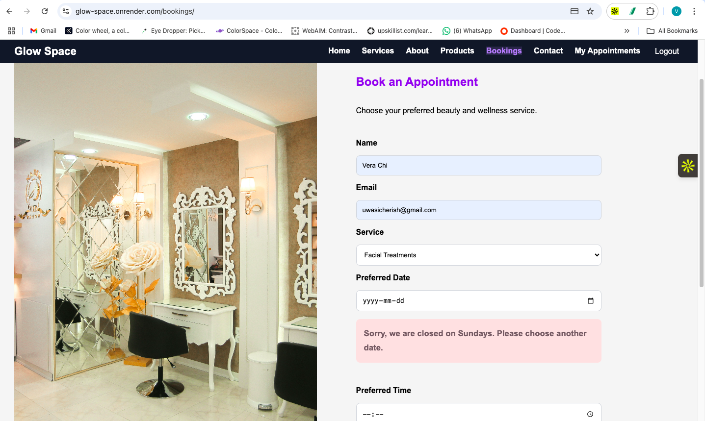
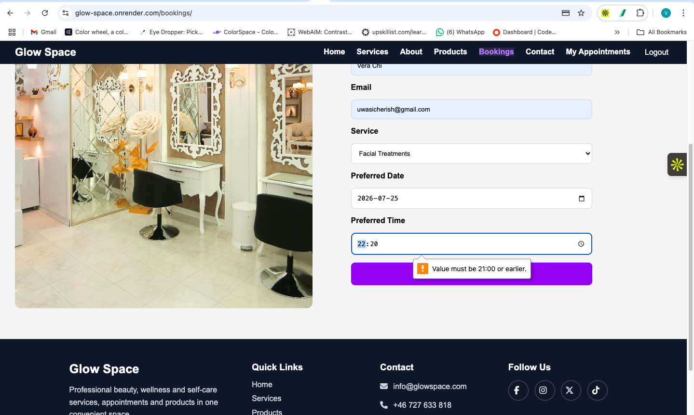
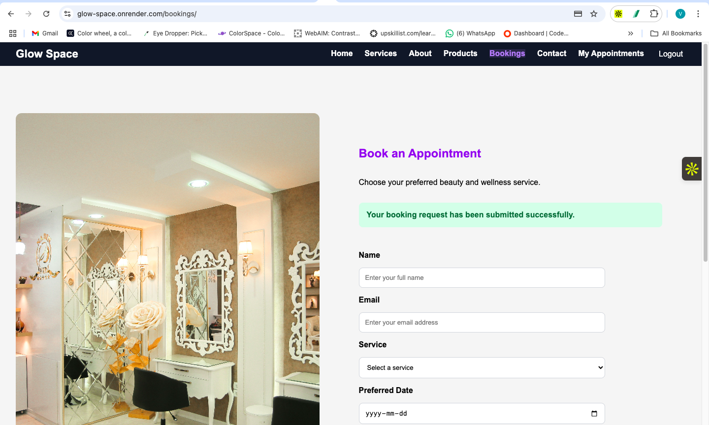
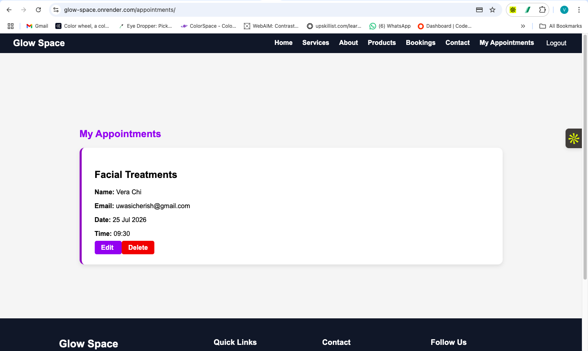
```

---

## Stripe Checkout Testing

Stripe was tested in test mode. No real payment-card details or real payments were used.

| Test | Expected Result | Actual Result | Outcome |
|---|---|---|:---:|
| Open checkout with items in cart | Stripe-hosted page opens | Checkout opened successfully | Pass |
| Compare total | Stripe amount matches cart | Correct total displayed in euros | Pass |
| Complete valid test payment | Payment accepted | Redirected to success page | Pass |
| View confirmation | Clear success feedback displayed | Payment Successful page displayed | Pass |
| Check cart after payment | Purchased cart items removed | Cart cleared | Pass |
| Cancel payment | Return without completing payment | Returned to cart and no payment completed | Pass |
| Use Buy Now | Only selected product included | Stripe received the selected product only | Pass |
| Attempt checkout while logged out | Redirect to login | Login page displayed | Pass |

The Stripe test card used was:

- Card number: `4242 4242 4242 4242`
- Expiry date: any future date
- CVC: any three digits
- Postal code: any valid postal code

### Stripe Evidence


```markdown
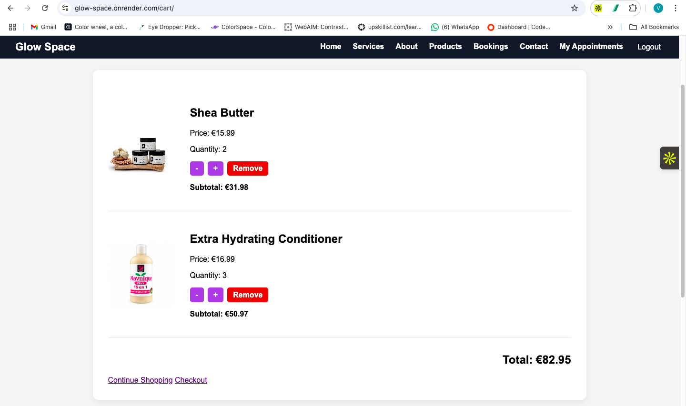

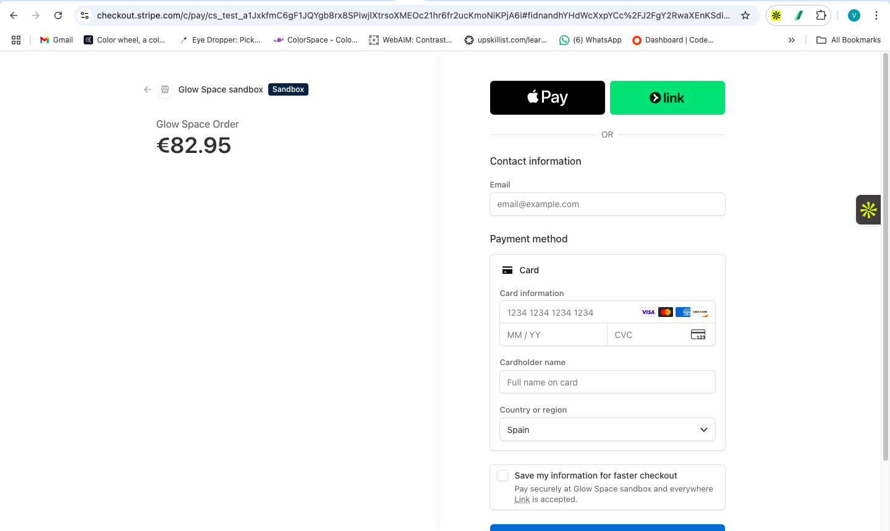

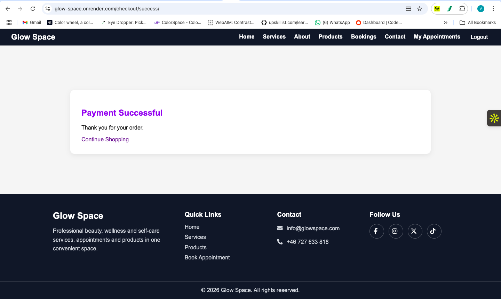
```

---

## Responsive Design Testing

Glow Space was tested across several screen widths using Chrome Developer Tools.

The main checks included:

- Unexpected horizontal scrolling.
- Overlapping content.
- Readable text.
- Image sizing.
- Navigation behaviour.
- Button and link usability.
- Form accessibility.
- Card alignment.
- Footer layout.
- Success and error message visibility.

### Screen Sizes Tested

| Device Type | Width | Method |
|---|---:|---|
| Mobile | 375px | Chrome Developer Tools |
| Large mobile | 425px | Chrome Developer Tools |
| Tablet | 768px | Chrome Developer Tools |
| Laptop | 1024px | Chrome Developer Tools |
| Desktop | 1440px | Chrome responsive mode |

### Responsive Page Testing

| Page or Feature | Mobile Result | Tablet Result | Desktop Result | Outcome |
|---|---|---|---|:---:|
| Navigation | Hamburger menu remained accessible | Navigation remained usable | Full navigation displayed | Pass |
| Homepage hero | Text and buttons remained readable | Layout adjusted to available width | Full hero layout displayed | Pass |
| Services carousel | One card remained usable | Cards displayed without overlap | Multiple cards displayed | Pass |
| About section | Content stacked correctly | Content remained aligned | Image and text displayed side by side | Pass |
| Product catalogue | Cards fitted within viewport | Grid adjusted correctly | Multiple columns displayed | Pass |
| Product details | Image and content remained readable | Layout adjusted correctly | Full product layout displayed | Pass |
| Booking form | Fields remained usable | Form fitted tablet width | Form and image displayed correctly | Pass |
| My Appointments | Cards fitted viewport | Details remained readable | Consistent spacing maintained | Pass |
| Shopping cart | Controls and totals remained usable | Layout adjusted correctly | Full cart layout displayed | Pass |
| Authentication pages | Forms fitted the viewport | Forms remained centred | Forms displayed with suitable spacing | Pass |
| Error pages | Message and button remained visible | Content remained centred | Full error layout displayed | Pass |
| Footer | Sections stacked without overlap | Sections remained readable | Multi-column layout displayed | Pass |

### Responsive Evidence

```markdown
#### Mobile

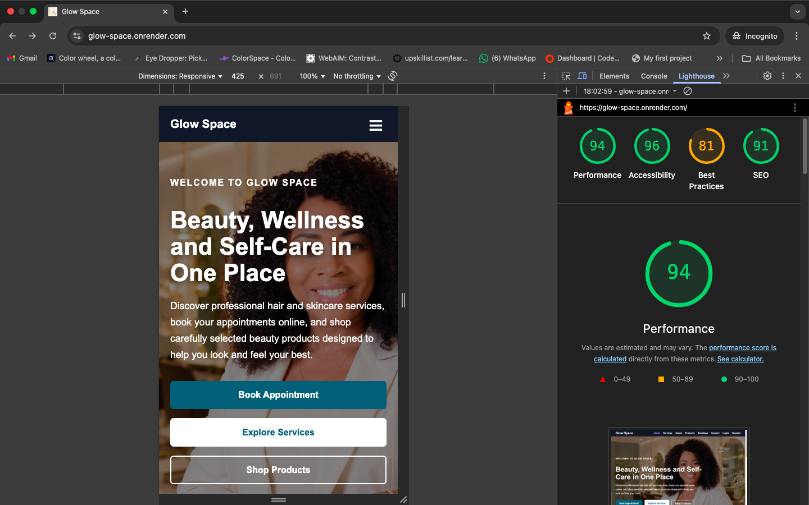

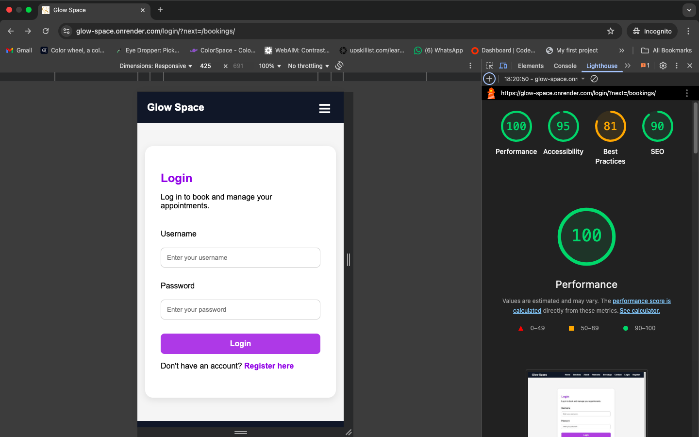

#### Tablet

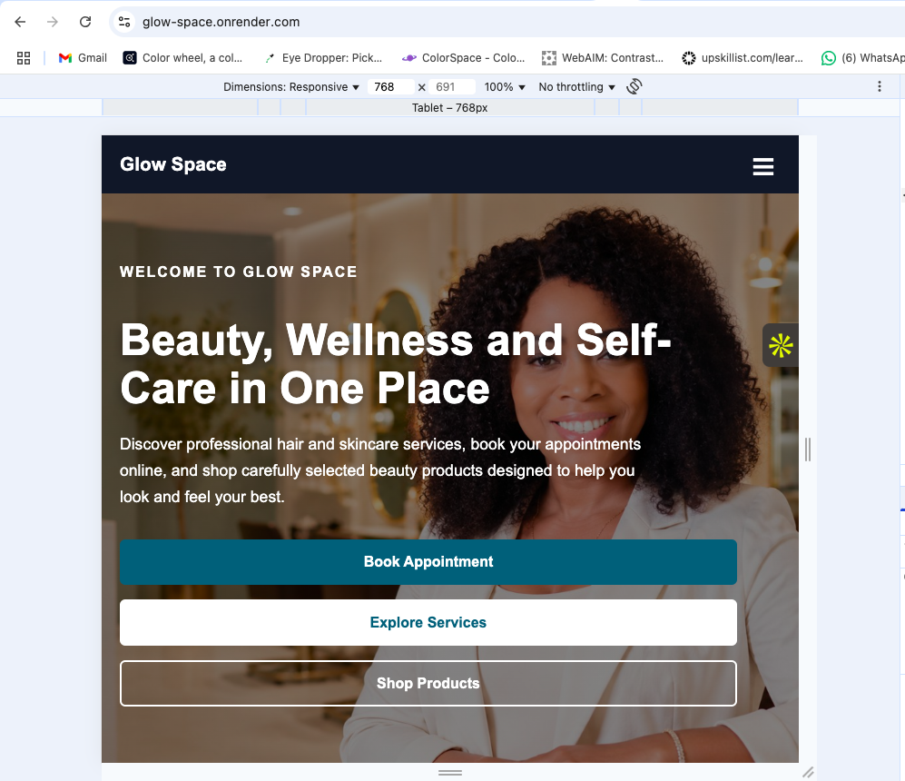

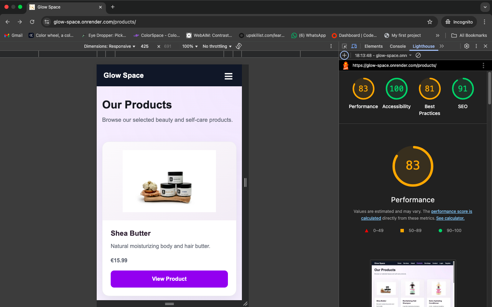

#### Desktop

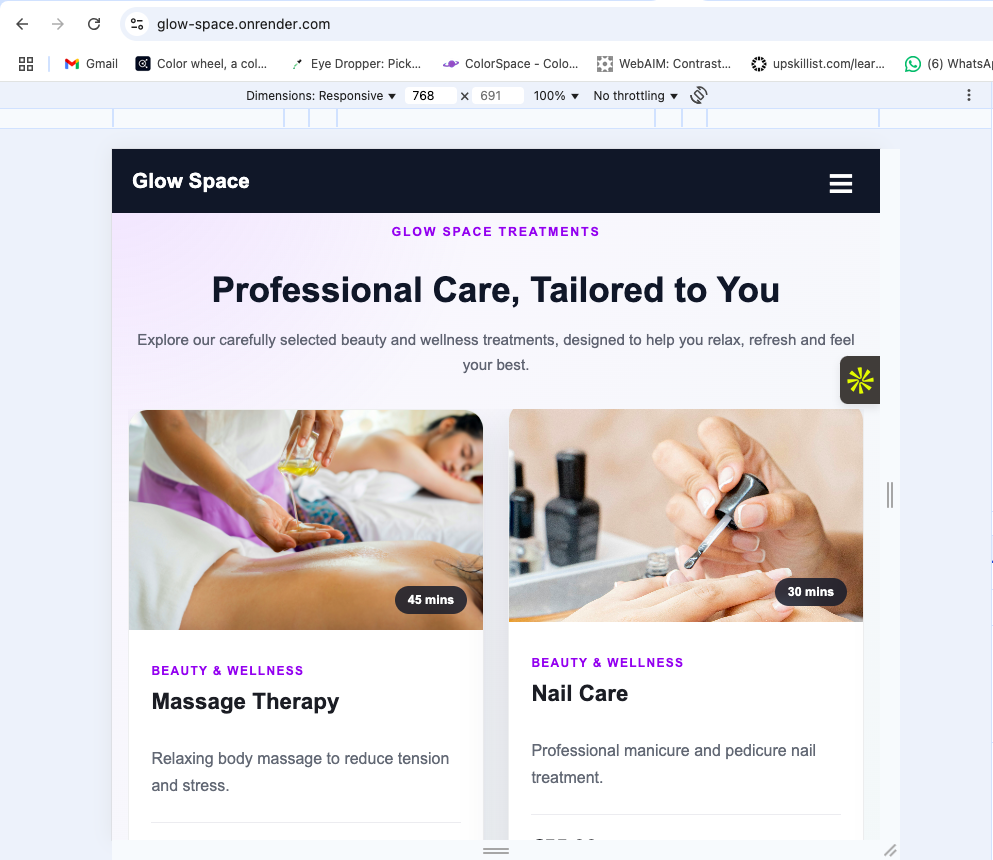

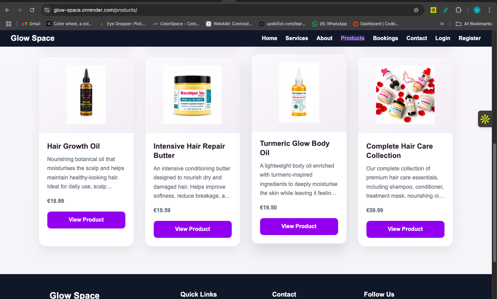
```

---

## Colour and Visual Consistency Testing

The colour palette and visual presentation were checked throughout the application to make sure the website felt consistent and suitable for a beauty salon.

Soft neutral and beauty-focused tones were used to create a calm, welcoming and elegant appearance. Darker text was used against lighter backgrounds to keep the content readable.

Accent colours were used for important actions such as booking, shopping and navigation so that users could identify interactive elements easily.

The following points were checked:

- Text remained readable against its background.
- Main buttons were easy to distinguish from surrounding content.
- Hover and focus states provided visible feedback.
- Success and error messages could be recognised clearly.
- Cards, forms, navigation and footer sections used consistent styling.
- The colour palette remained consistent across different pages.
- Colour was not used as the only way to explain an action or error.
- Visual contrast remained understandable on mobile, tablet and desktop layouts.

Lighthouse accessibility testing was also used to identify possible contrast, labelling and usability issues.

---

## Browser Compatibility Testing

The deployed application was tested using modern browsers.

| Browser | Result |
|---|:---:|
| Google Chrome | Pass |
| Microsoft Edge | Pass |
| Mozilla Firefox | Pass |

The following features were checked:

- Navigation.
- Authentication.
- Appointment booking.
- Appointment management.
- Product catalogue.
- Shopping cart.
- Stripe Checkout redirection.
- Responsive layouts.
- Images and static files.

No significant browser-specific errors were identified.

---

## Code Validation

### HTML Validation

The deployed site was tested using the W3C Nu HTML Checker.

The homepage, Products page and Registration page passed without HTML errors or warnings.

The Services, About and Contact areas are sections of the homepage, so they were covered by the homepage validation rather than being separate HTML documents.

Protected pages were also checked manually while logged in because an external validator cannot use the authenticated browser session.

| Page | Result |
|---|---|
| Homepage, including Services, About and Contact | Pass |
| Products page | Pass |
| Registration page | Pass |
| Booking page | Checked manually while logged in |
| My Appointments | Checked manually while logged in |
| Product detail page | Checked manually |
| Shopping cart | Checked manually while logged in |

```markdown
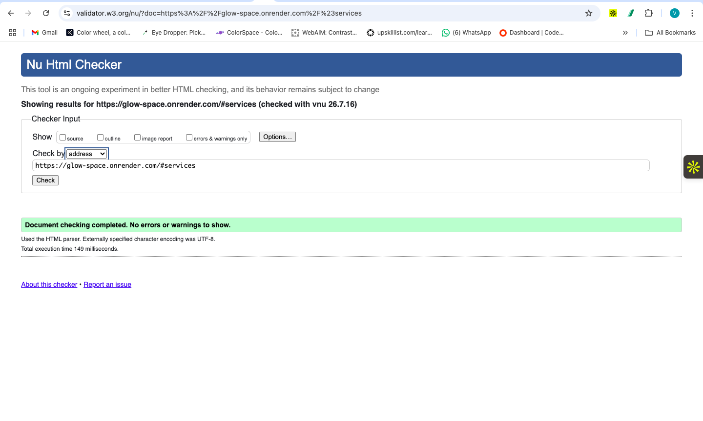
```

### CSS Validation

The project stylesheet was checked using the official W3C CSS Validation Service.

The initial validation identified older Microsoft grid declarations generated by Autoprefixer. These declarations were not needed by the application and were removed.

After correction, the stylesheet passed with no CSS errors.

Some vendor-prefix warnings may remain because browser-specific properties are used for compatibility. These warnings do not prevent the stylesheet from being valid.

```markdown
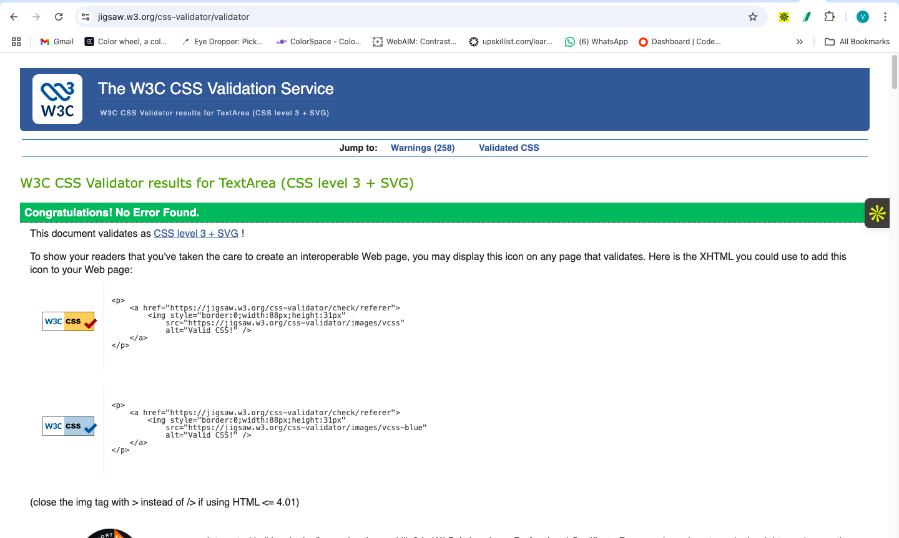
```

### Python Validation

Python files in the `home` and `config` directories were checked using Flake8.

The command used was:

```bash
python -m flake8 home config --exclude=migrations,venv
```

The first check reported one unused import in `home/tests.py`:

```text
F401 'django.test.TestCase' imported but unused
```

The unused import was removed and Flake8 was run again.

The final command completed without returning any errors.

```markdown
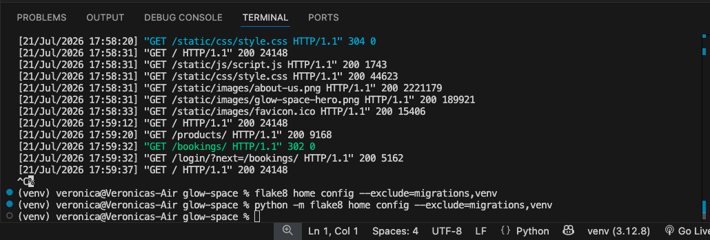
```

### Django Checks

Django’s system check was run using:

```bash
python manage.py check
```

The result was:

```text
System check identified no issues (0 silenced).
```

```markdown
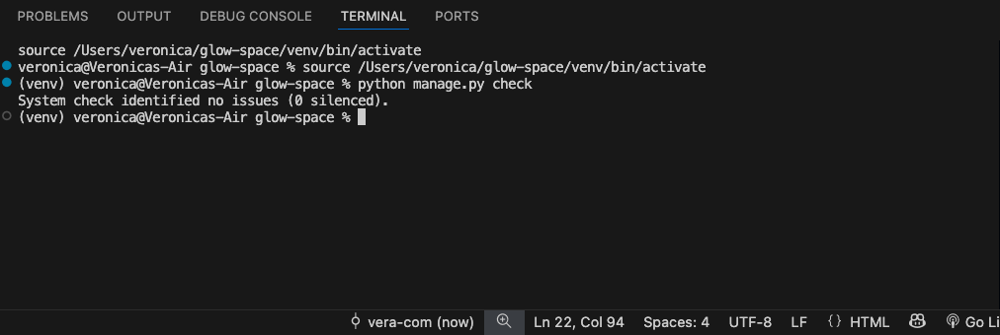
```

The model and migration files were also checked using:

```bash
python manage.py makemigrations --check
```

The result was:

```text
No changes detected
```

This confirmed that the current models and migration files were in sync.

---

## Lighthouse Testing

Lighthouse was used to test performance, accessibility, best practices and search-engine optimisation on the deployed application.

A completed mobile homepage audit returned:

| Category | Score |
|---|---:|
| Performance | 94 |
| Accessibility | 96 |
| Best Practices | 81 |
| SEO | 91 |

The results showed strong performance and accessibility.

The main recommendations included:

- Optimising and resizing large images.
- Using more efficient image formats.
- Reducing render-blocking resources.
- Reducing unused CSS and JavaScript.
- Improving some touch-target spacing.
- Adding or improving page metadata.
- Reviewing security-header recommendations.

Lighthouse results varied between runs. This was affected by:

- Render response times and cold starts.
- Network conditions.
- Browser activity.
- Image loading.
- External resources.
- Lighthouse trace failures.

Some runs returned a `NO_NAVSTART` message. This indicated that Lighthouse failed to record the page-navigation trace and did not mean that the application itself had failed.

Only completed audits were used when recording results.

```markdown

```

---

## Bugs Encountered and Fixed

| Bug or Challenge | Cause | Resolution | Status |
|---|---|---|:---:|
| Services disappeared from the homepage | The Service queryset was not passed to the template | Updated the home view to include services in the context | Fixed |
| A service image did not display | The image was referenced outside the service loop | Rebuilt the section using a valid service loop | Fixed |
| Template produced `TemplateSyntaxError` | Missing closing `` tag | Added the missing template tag | Fixed |
| Service cards became uneven or cut off | Original slider relied on fixed widths and scroll distances | Replaced custom slider with Swiper | Fixed |
| Carousel controls displayed inconsistently | Old CSS conflicted with Swiper styling | Removed obsolete rules and scoped carousel styles | Fixed |
| Product images appeared cropped | Images used `object-fit: cover` | Changed product image presentation to `object-fit: contain` | Fixed |
| Product cards were uneven | Descriptions had different lengths | Used Flexbox and automatic button margins | Fixed |
| Buy Now included existing cart items | Buy Now reused normal cart checkout | Created a separate Buy Now checkout flow | Fixed |
| Invalid appointment dates and times were accepted | Original booking validation was incomplete | Added server-side validation for dates, times, Sundays, opening hours and duplicate slots | Fixed |
| Stripe redirected to a missing page | Success template had not been created | Added and connected the payment-success template | Fixed |
| Default Django 404 page appeared locally | `DEBUG=True` displays Django’s technical page | Tested custom error pages using `DEBUG=False` | Fixed |
| User could enter a different booking name | User identity was not sufficiently controlled | Connected booking identity to the authenticated user | Fixed |
| Users required stronger record protection | Booking retrieval originally relied mainly on the booking ID | Added `user=request.user` to edit and delete lookups | Fixed |
| CSS validator reported Microsoft grid declarations | Autoprefixer generated old browser syntax | Removed unnecessary declarations | Fixed |
| Flake8 reported an unused import | Default test-file import was not used | Removed the unused import | Fixed |

---

## Known Limitations

The following limitations remain in the current version:

| Limitation | Impact | Possible Future Improvement |
|---|---|---|
| The project uses one main custom Django app | Features are less separated than they would be in a larger application | Separate bookings, products and checkout into reusable apps |
| Booking service is stored as a text choice | Service records and booking choices are not directly related | Replace the choice field with a foreign key to Service |
| Completed payments are not stored in an Order model | Users do not have an order-history page | Add Order and OrderItem models |
| Stripe cancellation has no dedicated message | User returns to the cart without a clear cancellation notice | Add a cancellation view and message |
| Some uploaded images are large | Images may affect page-loading performance | Compress images and use modern formats |
| Duplicate booking checks focus on identical slots | Different services could potentially overlap by duration | Add service-duration and overlap checking |
| Automated Django tests were not completed | Testing relies mainly on structured manual procedures | Add model, view, permission and checkout tests |
| Lighthouse results vary | Scores may differ depending on hosting and network conditions | Optimise assets and continue performance monitoring |

These limitations do not prevent the main booking, cart, authentication or Stripe test workflows from functioning.

---

## Testing Summary

The main Glow Space workflows were tested locally and on the deployed Render application.

Testing confirmed that:

- Visitors can browse services and products.
- Users can register, log in and log out.
- Protected pages redirect logged-out users to login.
- Authenticated users can create appointments.
- Invalid dates, times and duplicate slots are prevented.
- Users can view, edit and delete only their own appointments.
- Products can be added to a user-specific cart.
- Cart quantities, subtotals and totals update correctly.
- Stripe test payments can be completed successfully.
- Buy Now includes only the selected product.
- PostgreSQL records remain persistent.
- Uploaded media loads from AWS S3.
- The website responds correctly across mobile, tablet, laptop and desktop sizes.
- The application works in the tested browsers.
- HTML and CSS validation completed successfully.
- Python code passed the final Flake8 check.
- Django reported no system or migration issues.
- Custom 404 and 500 pages work when `DEBUG=False`.

The application meets its main purpose as an online salon booking and beauty-product platform. The remaining limitations have been documented honestly and can be addressed in future development.
